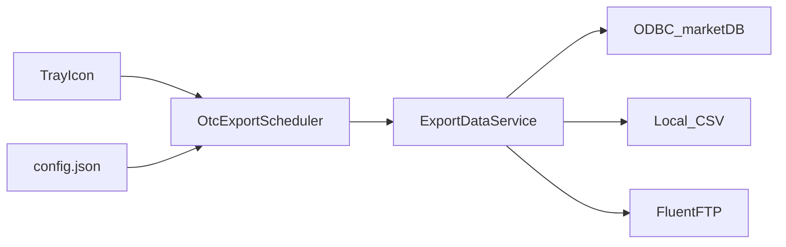

# OTC Data Service

Windows 系统托盘应用，通过 ODBC 从 market POS 数据库定期导出商品目录 CSV，并支持可选 FTP 上传。

| | |
|---|---|
| **Runtime** | .NET 8 (`net8.0-windows`) |
| **UI** | Avalonia 11.2 |
| **Architecture** | MVVM (`CommunityToolkit.Mvvm`) |
| **Version** | 0.1.0 |
| **License** | [MIT](LICENSE) |

---

## 功能特性 (Features)

- **系统托盘运行** — 关闭主窗口后应用隐藏至托盘，继续在后台运行
- **Enable / Disable 调度** — 通过托盘菜单启用或停用定时导出
- **设置界面** — Database（ODBC 连接）与 Export（导出参数、FTP）分栏配置
- **Activity Log** — 应用内实时日志，最多保留 500 条记录
- **单实例保护** — 本机 Mutex + 局域网 UDP 探测，同一网络仅允许一个实例
- **退出密码** — 托盘 Exit 需输入当前小时密码（格式 `yyyyMMddHH`）
- **ODBC 连接测试** — 设置页可测试 DSN 连通性，并提示进程 bitness
- **FTP 上传（可选）** — 导出完成后自动上传 CSV 至远程目录

---

## 架构与数据流 (Architecture)



### 导出逻辑

1. 从 `DBA.t_cleanup_trn` 查询近 **N** 天（`SalesLookbackDays`，默认 7）内有销售记录（`cu_trn_type = 'P'`）的商品编码（`cu_item`）
2. 关联以下表补全商品与分类信息：
   - `DBA.prodtable` — 商品主数据
   - `DBA.t_mkt_dep` — 部门 / 大类
   - `DBA.t_item_category` — 子类
3. 写入 UTF-8 CSV，文件名：`Catalog_{yyyyMMdd_HHmmss}.csv`
4. 若启用 FTP，将文件上传至配置的远程目录

### 调度规则

- 调度器每小时检查一次是否到期
- 当 `LastExportUtc` 为空，或距上次成功导出已满 `DocumentIntervalDays`（默认 1 天）时触发导出
- 启用调度时会校验 ODBC、导出参数、输出目录及 FTP 设置，并测试数据库连接

---

## CSV 输出格式 (Output Format)

| 列名 | 说明 |
|------|------|
| `ProductCode` | 商品编码 |
| `ProductCodeType` | 编码类型（如 UPC） |
| `ProductName` | 商品名称 |
| `CategoryCode` | 大类编码 |
| `CategoryDescription` | 大类描述 |
| `SubcategoryCode` | 子类编码 |
| `SubcategoryDescription` | 子类描述 |

示例文件：[doc/catalog_example.csv](doc/catalog_example.csv)

```csv
ProductCode,ProductCodeType,ProductName,CategoryCode,CategoryDescription,SubcategoryCode,SubcategoryDescription
000001154633595,UPC,XMAS FELT COASTERS,73,Seasonal Goods,731,Seasonal Products
```

---

## 配置说明 (Configuration)

配置文件路径（按用户存储，不随 MSI 安装到 Program Files）：

```
%LocalAppData%\OtcDataService\config.json
```

| 字段 | 默认值 | 说明 |
|------|--------|------|
| `odbcDsn` | `market2_64` | ODBC 数据源名称 |
| `odbcUserId` | `adm0` | 数据库用户名 |
| `odbcPassword` | *(内置默认值)* | 数据库密码 |
| `salesLookbackDays` | `7` | 销售回溯天数，用于筛选有销售记录的商品 |
| `documentIntervalDays` | `1` | 两次导出之间的最短间隔（天） |
| `outputFolder` | `%LocalAppData%\OtcDataService\Exports` | CSV 本地输出目录 |
| `ftpUploadEnabled` | `false` | 是否启用 FTP 上传 |
| `ftpHost` | `""` | FTP 服务器地址 |
| `ftpPort` | `21` | FTP 端口 |
| `ftpUserName` / `ftpPassword` | `""` | FTP 凭据 |
| `ftpRemotePath` | `"/"` | FTP 远程目录 |
| `lastExportUtc` | `null` | 上次成功导出的 UTC 时间（自动维护） |
| `isEnabled` | `false` | 调度器是否已启用（自动维护） |

> **安全提示：** 首次运行会使用内置默认数据库凭据。生产环境请通过 Settings UI 修改为实际凭据，且勿将 `config.json` 提交到版本库。

---

## ODBC 要求 (ODBC Requirements)

**ODBC DSN 的 bitness 必须与安装包一致**，否则无法连接数据库。

| 安装包 | 进程架构 | ODBC 管理器 |
|--------|----------|-------------|
| x86 (32-bit) | `win-x86` | `C:\Windows\SysWOW64\odbcad32.exe` |
| x64 (64-bit) | `win-x64` | `C:\Windows\System32\odbcad32.exe` |

默认 DSN 名称：`market2_64`（适用于 SQL Anywhere / market POS 环境）。

应用启动时会在 Activity Log 中记录当前进程架构，便于排查 bitness 不匹配问题。

---

## 快速开始 (Quick Start)

面向终端用户的操作步骤：

1. 安装与 ODBC DSN bitness 匹配的 MSI（`OtcDataService-setup-x86.msi` 或 `OtcDataService-setup-x64.msi`）
2. 在对应 bitness 的 ODBC 管理器中配置数据源
3. 启动应用 → **Settings** → **Database** → 测试连接
4. **Settings** → **Export** → 设置 lookback 天数、导出间隔、输出目录及 FTP（可选）
5. 托盘菜单 → **Enable** 启用调度
6. 在 Activity Log 与输出目录中查看 `Catalog_*.csv`

### 托盘菜单

| 菜单项 | 功能 |
|--------|------|
| **Enable** / **Disable** | 启用或停用导出调度 |
| **Setting** | 打开主窗口（Home / Settings） |
| **Exit** | 退出应用（需输入当前小时密码） |

> 关闭主窗口不会退出应用，应用会继续在托盘中运行。要完全退出请使用托盘 **Exit**。

---

## 开发与构建 (Development)

### 前置条件

- [.NET 8 SDK](https://dotnet.microsoft.com/download/dotnet/8.0)
- Windows 10 或更高版本
- 开发调试：已配置且 bitness 匹配的 ODBC DSN
- 构建 MSI：Visual Studio（含 MSBuild）+ [WiX Toolset 3.14](https://wixtoolset.org/)

### 常用命令

```powershell
# 开发运行
dotnet run --project OtcDataService\OtcDataService.csproj

# 构建
dotnet build OtcDataService\OtcDataService.csproj

# 发布（自包含，x64 示例）
dotnet publish OtcDataService\OtcDataService.csproj -c Release -r win-x64 --self-contained true

# 发布（自包含，x86 示例）
dotnet publish OtcDataService\OtcDataService.csproj -c Release -r win-x86 --self-contained true
```

### 构建 MSI 安装包

使用根目录脚本 [build_installer.ps1](build_installer.ps1)：

```powershell
# 默认：Release 配置，同时构建 x86 与 x64
.\build_installer.ps1

# 仅构建 x64
.\build_installer.ps1 -Platform x64

# 清理后重新构建
.\build_installer.ps1 -Clean

# 跳过应用发布（需已有 publish 输出）
.\build_installer.ps1 -SkipAppPublish
```

| 参数 | 可选值 | 说明 |
|------|--------|------|
| `-Configuration` | `Release`（默认）、`Debug` | 构建配置 |
| `-Platform` | `Both`（默认）、`x86`、`x64` | 目标平台 |
| `-OutputDir` | 默认 `.\publish\OtcDataService` | MSI 输出目录 |
| `-Clean` | — | 清理 bin/obj 及输出目录 |
| `-SkipAppPublish` | — | 跳过 `dotnet publish` 步骤 |

**构建产物：**

| 类型 | 路径 |
|------|------|
| 应用（x64） | `OtcDataService\bin\Release\net8.0-windows\publish\win-x64\OtcDataService.exe` |
| 应用（x86） | `OtcDataService\bin\Release\net8.0-windows\publish\win-x86\OtcDataService.exe` |
| MSI（x64） | `OtcDataService.Setup\bin\Release\x64\OtcDataService-setup-x64.msi` |
| MSI（x86） | `OtcDataService.Setup\bin\Release\x86\OtcDataService-setup-x86.msi` |
| 发布目录 | `publish\OtcDataService\`（含版本号与 latest 两份 MSI） |

---

## 安装与部署 (Installation)

MSI 安装包由 WiX 项目 [OtcDataService.Setup](OtcDataService.Setup/) 生成。

| 项目 | 说明 |
|------|------|
| 制造商 | MoleQ Inc. |
| 安装范围 | per-machine（本机所有用户） |
| 安装路径（x64） | `C:\Program Files\MoleQ\OtcDataService\` |
| 安装路径（x86） | `C:\Program Files (x86)\MoleQ\OtcDataService\` |
| 运行时依赖 | 无（自包含发布，无需单独安装 .NET Runtime） |
| 快捷方式 | 桌面 + 开始菜单 |
| 用户配置 | `%LocalAppData%\OtcDataService\`（config.json、Exports 目录） |

---

## 项目结构 (Project Structure)

```
otc_data_service/
├── OtcDataService/              # 主应用（Avalonia + MVVM）
│   ├── Services/                # 调度、导出、ODBC、FTP、配置、日志
│   ├── Repositories/            # ODBC 数据访问
│   ├── Models/                  # 配置与实体模型
│   ├── ViewModels/              # MVVM 视图模型
│   ├── Views/                   # Avalonia UI
│   └── Properties/PublishProfiles/
├── OtcDataService.Setup/        # WiX MSI 安装项目
├── doc/                         # 文档与示例
│   └── catalog_example.csv      # CSV 输出示例
├── build_installer.ps1          # 构建应用与 MSI 的脚本
├── OtcDataService.sln
└── LICENSE
```

### 主要依赖

| 包 | 用途 |
|----|------|
| Avalonia 11.2.5 | 跨平台桌面 UI |
| CommunityToolkit.Mvvm 8.4.1 | MVVM 框架 |
| FluentFTP 54.2.0 | FTP 上传 |
| System.Data.Odbc 8.0.0 | ODBC 数据库访问 |

---

## License

[MIT License](LICENSE) — Copyright (c) 2026 dearming623
